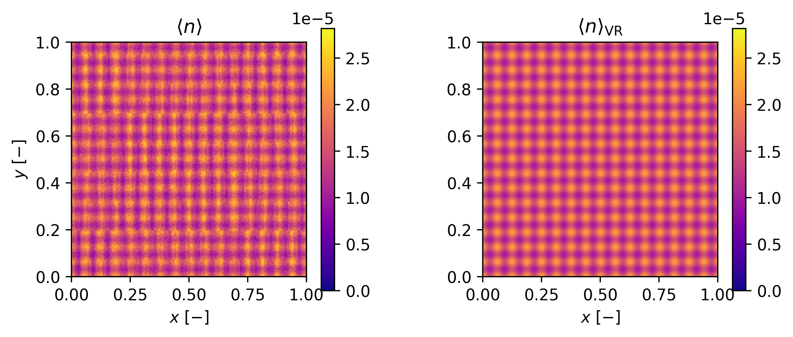
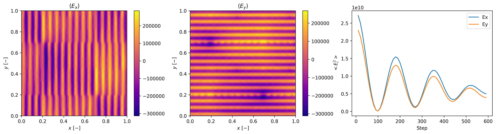

# Vlasov-Poisson with Variance Reduction

A CUDA/C++ implementation of the **particle-based solution** to the **Vlasov–Poisson equation** with **Variance Reduction** using **importance sampling weights**. This project provides a high-performance GPU-accelerated framework for simulating plasma dynamics with reduced statistical noise, and enabling more accurate long-time evolution of distribution functions.

---

## Overview

The **Vlasov–Poisson equation** describes the evolution of a plasma or charged particle system under self-consistent electric fields. Traditional particle-in-cell (PIC) methods can suffer from high variance due to noise. The proposed method addresses this challenge by taking advantage of the correlation between the non-equilibrium and equilibrium simulations via  **importance weights**. For example, the number density profile for Landau Damping test case at the finite time can be estimated with a lower variance compared to standard MC.





---

## Features

- **Fully GPU-accelerated**: Uses CUDA to parallelize moment computation, particle updates, and field (Poisson) solver.
- **Variance reduction (VR)**: Implements control variate methods to reduce noise in moment computations.
- **Importance weighting**: Dynamically adjusts particle weights using local Maxwellian-Boltzmann distribution as control variate.
- **Self-consistent field solving**: Solves the Poisson equation using FFT.
- **Post-processing output**: Dumps moment fields for visualization and diagnostics.

---

## 🛠️ Build Instructions

### Requirements

- CUDA Toolkit (>= 11.x recommended)
- C++ compiler with C++11 or higher
- CMake

### Build

```bash
git clone https://github.com/yourusername/vlasov-poisson.git
cd vlasov-poisson
mkdir bin && cd bin
cmake ..
make
```
### Execution

The compiled executabale can be run by
```
./main N_GRID_X N_GRID_Y N_PARTICLES DT NSteps Lx Ly threadsPerBlock deposition_mode VRMode [pdf_type] [pdf_params...]
```
where ```deposition_mode: brute | tiling | sorting``` and ```VRMode: basic | MXE```.

For example:

``` ./main 128 128 1000000 0.01 100 1.0 1.0 256 brute basic gaussian 0.5```

For the command line of executioning different test cases, see the header in ```src/main.cpp```.
